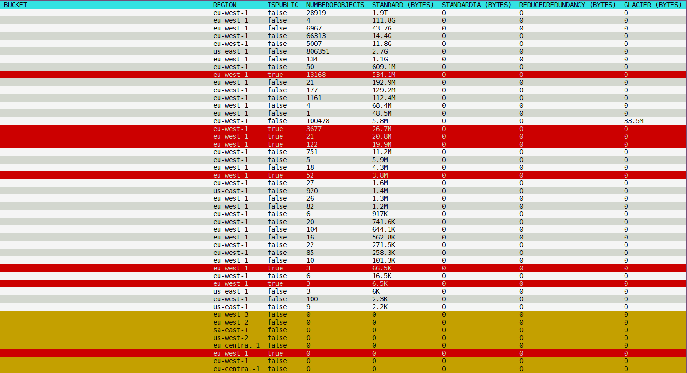

# Description

A tool to list all S3 Buckets of an AWS account with their main statistics. Buckets are sorted by size.

# Usage
```
Usage of s3-describe:
    -profile string
        Profile from ~/.aws/config (default "default")
    -region (only to create session) string
        Region (default "eu-west-1")
```

# Output Example



* *red* : Public Bucket
* *yellow* : Empty Bucket

# Author

Thomas Labarussias (thomas.labarussias@fr.clara.net - https://github.com/Issif)